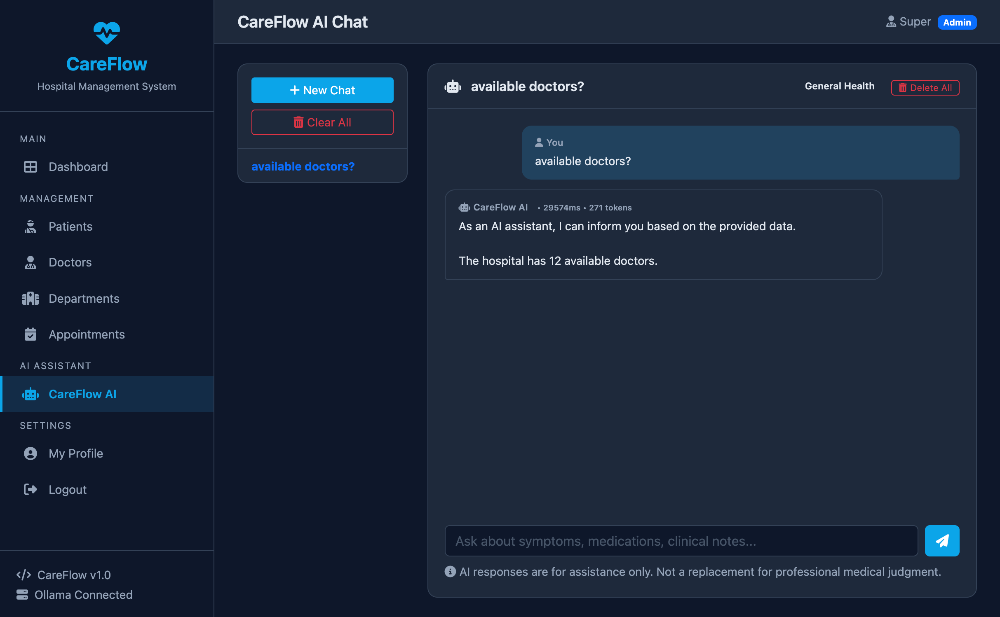

# 🏥 CareFlow — Hospital Management System



A full-featured **Hospital Management System** built with Django, MySQL, and an AI-powered assistant. CareFlow streamlines patient registration, doctor scheduling, appointment management, and provides an intelligent chat assistant powered by Ollama LLMs.

---

## ✨ Features

### 👥 Patient Management
- Register and manage patient records with comprehensive profiles
- Track medical history, chronic conditions, allergies, and medications
- Emergency contact information and insurance details
- Auto-generated patient IDs (`PT000001`)

### 👨‍⚕️ Doctor Management
- Manage doctor profiles with specializations, qualifications, and consultation fees
- Department-based organization with department heads
- Availability scheduling (days, hours, max patients per day)
- Auto-generated doctor IDs (`DR000001`)

### 📅 Appointment Management
- Schedule, confirm, check-in, and complete appointments
- Multiple appointment types: consultation, follow-up, emergency, routine checkup, surgery consult, lab review, vaccination
- Priority levels: normal, urgent, emergency
- Track vital signs, diagnosis, prescriptions, and lab orders
- Follow-up date tracking
- Auto-generated appointment IDs (`AP00000001`)

### 🤖 AI Assistant
- Intelligent chat interface powered by **Ollama** LLMs
- Real-time database context — the AI knows current patient counts, doctor availability, and appointment statistics
- Flask microservice bridges Django and Ollama
- Context-aware responses based on live hospital data

### 🏢 Department Management
- Multi-department support with floor locations and phone extensions
- Department heads assigned from doctor roster
- 15 departments covering all major medical specialties

### 🔐 Role-Based Access Control
- User roles: Admin, Doctor, Receptionist, Nurse, Pharmacist, Lab Technician, Patient
- Django authentication with session management
- Profile system extending Django's User model

---

## 🏗️ Architecture

```
┌─────────────┐     ┌──────────────────┐     ┌─────────────────┐
│   Caddy     │────▶│   Django App     │────▶│     MySQL       │
│ (Reverse    │     │  (Gunicorn WSGI) │     │ (Database)      │
│  Proxy)     │     │     :8000        │     │ :3306           │
└─────────────┘     └────────┬─────────┘     └─────────────────┘
                             │
                             │ POST /api/chat
                             ▼
                    ┌──────────────────┐     ┌─────────────────┐
                    │   Flask AI       │────▶│    Ollama       │
                    │  (Gunicorn WSGI) │     │ (LLM Engine)    │
                    │     :5001        │     │ :11434          │
                    └──────────────────┘     └─────────────────┘
```

### Services

| Service | Container | Port | WSGI Server | Description |
|---------|-----------|------|-------------|-------------|
| **MySQL** | `careflow-mysql` | 3306 | — | Primary database |
| **Django** | `careflow_app` | 8000 | **Gunicorn** | Web application serving all hospital management features |
| **Flask AI** | `careflow-flask-ai` | 5001 | **Gunicorn** | AI chat bridge — relays requests from Django to Ollama |

---

## 🚀 Quick Start

### Prerequisites

- [Docker](https://docs.docker.com/get-docker/) & [Docker Compose](https://docs.docker.com/compose/install/)
- [Ollama](https://ollama.ai/) running with a model (e.g., `gemma2:4b` or `gemma4:e2b`)

### 1. Clone & Navigate

```bash
git clone <your-repo-url> careflow
cd careflow
```

### 2. Configure Environment

Edit `docker-compose.yml` to match your setup:

```yaml
environment:
  - DJANGO_SECRET_KEY=your-secret-key-here
  - DEBUG=True
  - ALLOWED_HOSTS=careflow.duckdns.org,localhost,127.0.0.1
  - DB_NAME=careflow_db
  - DB_USER=careflow_user
  - DB_PASSWORD=Careflow@2024!
  - DB_HOST=mysql
  - DB_PORT=3306
  - OLLAMA_MODEL=gemma4:e2b
  - FLASK_AI_URL=http://flask-ai:5001
```

### 3. Start the Stack

```bash
docker-compose up -d --build
```

This builds and starts all three containers:
- MySQL database
- Django application
- Flask AI bridge

### 4. Run Database Migrations

```bash
docker exec careflow_app python manage.py migrate
```

### 5. Seed Sample Data

```bash
docker exec careflow_app python manage.py shell < seed_data/seed.py
```

This creates:
- **1 Superuser** — `admin` / `Admin@2025`
- **6 Staff users** — receptionists, nurses, pharmacist, lab technician
- **15 Departments** — General Medicine, Cardiology, Orthopedics, etc.
- **20 Doctors** — with realistic Indian names and specializations
- **30 Patients** — with comprehensive medical profiles
- **50 Appointments** — past and future, with various statuses

### 6. Access the Application

| URL | Description |
|-----|-------------|
| `http://localhost:8000` | Main dashboard |
| `http://localhost:8000/admin/` | Django admin panel |
| `http://localhost:8000/accounts/login/` | Login page |
| `http://localhost:8000/ai/` | AI Assistant chat |

### Demo Credentials

| Username | Password | Role |
|----------|----------|------|
| `admin` | `Admin@2025` | Superuser / Admin |
| `receptionist1` | `Staff@2024` | Receptionist |
| `nurse1` | `Staff@2024` | Nurse |

---

## 📁 Project Structure

```
careflow/
├── accounts/              # User accounts & profiles
│   ├── models.py          # Profile model (role, phone, DOB, gender)
│   ├── views.py           # Login, registration, profile views
│   ├── forms.py           # Authentication forms
│   └── urls.py            # Account routes
│
├── patients/              # Patient management
│   ├── models.py          # Patient model (full medical profile)
│   ├── views.py           # CRUD operations
│   ├── forms.py           # Patient forms
│   └── urls.py            # Patient routes
│
├── doctors/               # Doctor & department management
│   ├── models.py          # Doctor & Department models
│   ├── views.py           # CRUD operations
│   ├── forms.py           # Doctor forms
│   └── urls.py            # Doctor routes
│
├── appointments/          # Appointment scheduling
│   ├── models.py          # Appointment, Prescription, PrescriptionItem
│   ├── views.py           # Scheduling & management
│   ├── forms.py           # Appointment forms
│   └── urls.py            # Appointment routes
│
├── ai_assistant/          # AI-powered chat assistant
│   ├── models.py          # Conversation & message models
│   ├── views.py           # Chat interface & DB context
│   └── urls.py            # AI routes
│
├── careflowproject/       # Django project configuration
│   ├── settings.py        # Settings (DB, apps, middleware, etc.)
│   ├── urls.py            # Root URL configuration
│   └── wsgi.py            # WSGI entry point
│
├── docker/                # Docker configuration
│   ├── Django.Dockerfile  # Django container build
│   ├── Flask.Dockerfile   # Flask AI container build
│   └── ai_service.py      # Flask AI bridge service
│
├── seed_data/
│   └── seed.py            # Database seeder with realistic data
│
├── static/                # Static assets (CSS, JS)
├── templates/             # Django templates
├── media/                 # User-uploaded files
├── docker-compose.yml     # Multi-container orchestration
├── requirements.txt       # Python dependencies
└── manage.py              # Django management script
```

---

## 🧠 AI Assistant

The AI assistant connects to a local **Ollama** instance to provide intelligent responses based on live hospital data.

### How It Works — Full Request Chain

```
User types message in browser
        │
        ▼
┌─────────────────────────────────┐
│ 1. Django (Gunicorn WSGI :8000) │
│    • ai_assistant/views.py      │
│    • get_db_context() queries   │
│      MySQL for live stats       │
│    • Builds system prompt with  │
│      real-time hospital data    │
└────────────┬────────────────────┘
             │
             │ POST /api/chat
             │ JSON: { model, messages, stream }
             │
             ▼
┌─────────────────────────────────┐
│ 2. Flask AI (Gunicorn WSGI :5001)│
│    • docker/ai_service.py       │
│    • Receives request from      │
│      Django via HTTP POST       │
│    • Forwards to Ollama's       │
│      /api/chat endpoint         │
└────────────┬────────────────────┘
             │
             │ POST /api/chat
             │ JSON: { model, messages, stream }
             │
             ▼
┌─────────────────────────────────┐
│ 3. Ollama (LLM Engine :11434)   │
│    • Processes the prompt       │
│    • Generates AI response      │
└────────────┬────────────────────┘
             │
             │ Response flows back:
             │ Ollama → Flask → Django → Browser
             ▼
      User sees AI response
```

### Detailed Step-by-Step

1. **User sends a message** in the chat interface at `/ai/`
2. **Django's `ai_assistant/views.py`** handles the request:
   - Calls `get_db_context(user_message)` which queries **MySQL** for real-time stats (patient count, doctor availability, today's appointments, pending schedules)
   - Builds a `system` prompt containing this live data
   - Constructs a chat history payload with the system prompt + recent messages
3. **Django makes an HTTP POST** to `http://flask-ai:5001/api/chat` with `{ "model": "gemma4:e2b", "messages": [...], "stream": false }`
4. **Flask AI bridge** (`docker/ai_service.py`) receives the request and forwards it to **Ollama** at `http://localgen_brain:11434/api/chat`
5. **Ollama** processes the prompt and returns the AI response
6. The response travels back: Ollama → Flask → Django → rendered in the browser

### Why Two Gunicorn Services?

Both Django and Flask run under **Gunicorn** (a production WSGI server) rather than their built-in dev servers:

| Service | CMD | Why Gunicorn? |
|---------|-----|---------------|
| **Django** | `gunicorn --bind 0.0.0.0:8000 careflowproject.wsgi:application` | Production-ready, handles multiple concurrent requests, proper worker management |
| **Flask AI** | `gunicorn --timeout 180 --bind 0.0.0.0:5001 ai_service:app` | Same benefits + `--timeout 180` because LLM responses can take up to 3 minutes |

### Configuration

Set these environment variables in `docker-compose.yml`:

```yaml
# Django container
environment:
  - OLLAMA_MODEL=gemma4:e2b                  # Which Ollama model to use
  - FLASK_AI_URL=http://flask-ai:5001        # Flask bridge endpoint

# Flask AI container
environment:
  - OLLAMA_URL=http://localgen_brain:11434   # Ollama endpoint
  - OLLAMA_MODEL=gemma4:e2b                  # Must match Django's setting
```

---

## 🛠️ Development

### Running Locally (Without Docker)

```bash
# Create virtual environment
python -m venv venv
source venv/bin/activate

# Install dependencies
pip install -r requirements.txt gunicorn

# Configure database in settings.py (use SQLite for local dev)
# Set environment variables or edit settings.py

# Run migrations
python manage.py migrate

# Seed data
python manage.py shell < seed_data/seed.py

# Start development server
python manage.py runserver
```

### Useful Commands

```bash
# Rebuild and restart a single service
docker-compose build django
docker-compose up -d django

# View logs
docker-compose logs -f django

# Access Django shell inside container
docker exec -it careflow_app python manage.py shell

# Run migrations
docker exec careflow_app python manage.py migrate

# Create new app
docker exec careflow_app python manage.py startapp <app_name>

# Collect static files
docker exec careflow_app python manage.py collectstatic --noinput
```

---

## 🔧 Troubleshooting

### Container name conflict
```bash
# Remove old container
docker rm -f careflow-mysql careflow_app careflow-flask-ai
# Or do a full teardown
docker-compose down
docker-compose up -d
```

### MySQL connection issues
```bash
# Check if MySQL is running
docker exec -it careflow-mysql mysql -u careflow_user -p careflow_db
# Verify Django can connect
docker exec careflow_app python manage.py check --database default
```

### AI Assistant not responding
```bash
# Check Flask bridge health
curl http://localhost:5001/health
# Verify Ollama is running
curl http://localgen_brain:11434/api/tags
```

---

## 📋 Requirements

```
Django>=4.2,<5.0
mysqlclient
Pillow
requests
gunicorn
```

---

##  Acknowledgements

- Built with [Django](https://www.djangoproject.com/)
- AI powered by [Ollama](https://ollama.ai/)
- Containerized with [Docker](https://www.docker.com/)